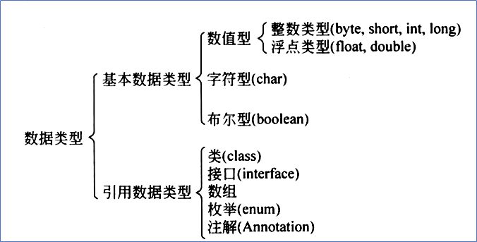
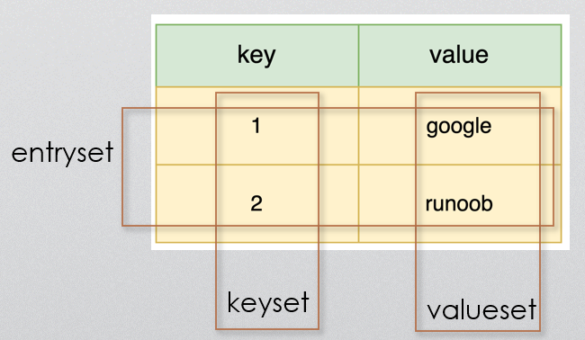
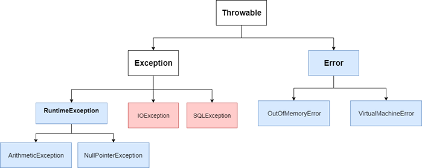

# note1

## Java Basics

### Java Syntax

#### Data Types



```java
package a;

import java.util.ArrayList;
import java.util.List;

public class JavaBasics {
    public static void main(String[] args) {
        // 基本数据类型
        // 数值型：整数类型（byte, short, int, long） and 浮点类型（float, double）
        int myInt = 5;
        float myFloat = 5.99f;  // 不加f会报错，因为默认是double
        // 字符型
        char myLetter = 'A';
        char myVar = 65;
        System.out.println(myVar);  // A
        // 布尔型
        boolean myBool = true;

        // 每个基本类型都有对应的封装类
        Float myFloat2 = 5.99f;
        Integer myInt2 = 5;

        // 自动转型
        double myDouble = myInt;
        System.out.println(myDouble + " " + myInt);  // 5.0 5
        // 强制转型
        double myDouble2 = 12.6d;
        int myInt3 = (int)myDouble2;  // 下取整
        System.out.println(myDouble2 + " " + myInt3);  // 12.6 12

        // 引用数据类型：类/接口/数组/枚举/注解
        // String类型
        String str = "hello";
        System.out.println(str.length());
        System.out.println(str.substring(1));  // ello
        System.out.println(str.substring(1, 4));  // ell  前开后闭
        // String-字符/字符串查找
        System.out.println(str.indexOf('l'));  // 2
        System.out.println(str.lastIndexOf('l'));  // 3
        System.out.println(str.indexOf("ll"));  // 2
        System.out.println(str.indexOf("hll"));  // -1
        // String-字符串匹配（只能匹配字符串，不能匹配字符）
        System.out.println(str.contains("hl"));  // false
        System.out.println(str.startsWith("ell"));  // false
        System.out.println(str.endsWith("llo"));  // true
        // System.out.println(str.matches(String regex));  // 正则表达式
    }
}
```

### Object oriented programming

#### **Class and Object**

1. 局部变量存放在栈

2. **对象**存放在**堆**

   **GC (Garbage Collector) of JVM** automatically deletes **objects** in the **heap** that is no longer used, to free up memory space.

3. 类存放在堆


#### Overloading

A methods is identified by its **signature**, which consists of the method **name and parmeter types**.

以下两个方法拥有相同的signature，即`test(String, int)`

``` java
public String test(String s, int a) {
    return "test3";
}
public void test(String x, int y) {
    
}
```

#### **Abstract Classes and Methods**

Abstract class：不能创建对象；可被继承；可同时拥有抽象方法和常规方法

Abstract method：只能用在抽象类里；无方法体

#### Interfaces

接口的方法都是抽象方法

### Collections

**Interface**

Collection, List，Set，Map

**Concreate Classes**

* List： ArrayList，LinkedList
* Set： HashSet，TreeSet
* Map： Hashmap，TreeMap

#### ArrayList

```java
// ArrayList
List<String> list = new ArrayList<>();  // List是一个接口，而ArrayList是List接口的一个实现类

list.add("world");  // 尾部插入
list.add(0, "Hello");  // 头部插入

System.out.println(list.size());
System.out.println(list.get(0));
System.out.println(list.contains("World"));  // 判断是否包含某个元素，将逐个元素调用equals方法对比
```

```java
// 遍历法一：for-each
for (String str: list) {
    System.out.println(str);
}

// 遍历法二：迭代器（与第一种等价）
Iterator<String> ite = list.iterator();
while (ite.hasNext()) {  // 判断下一个元素是否有值
    System.out.println(ite.next());
}

// 遍历法三：按下标遍历
for (int i = 0; i < list.size(); i++) {
    System.out.println(list.get(i));
}
```

#### Map

```java
Map<String, String> map = new Hashmap<String, String>();

map.put("1", "value1");
map.put("2", "value2");
```



```java
// 遍历法一：普遍使用，二次取值
for (String key: map.keySet()) {
    System.out.println("key = " + key + " and value = " + map.get(key));
}

// 遍历法二：迭代器
Iterator<Map.Entry<String, String>> ite = map.entrySet().iterator();  // entrySet()即entry的集合
while (ite.hasNext()) {
    Map.Entry<String, String> entry = ite.next();  // Map.Entry个人理解为一个键值对，一个条目
    System.out.println("key = " + entry.getKey() + " and value = " + entry.getValue());
}

// 遍历法三：推荐，尤其容量大时
for (Map.Entry<String, String> entry: map.entrySet()) {
    System.out.println("key = " + entry.getKey() + " and value = " + entry.getValue());
}

// 遍历法四：只想取value的时候使用
for (String v: map.values()) {
    System.out.println("value = " + v);
}
```

### Exception Handling



* Checked Exception
  * Caused by user errors or problems
  * If not caught, cannot be compiled.

* Runtime Exception
  * Often caused by bugs
  * Is not forced to be caught（不能try-catch）

* Error
  * Indicate that an error has occurred in the runtime environment. E.g, a JVM memory overflow. 
  * Do not catch it!

### 其他

Java8新特性 https://www.runoob.com/java/java8-new-features.html

