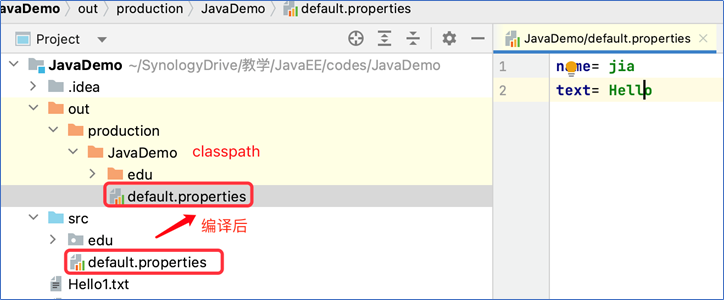

# note2

## Stream and IO

### Java IO classes


#### Reader and Writer

```java
import java.io.File;
import java.io.FileReader;
import java.io.FileWriter;
import java.io.IOException;

public class FileReaderAndWritter {

    public static void main(String[] args) {

        File file = new File("Hello1.txt");

        try(FileWriter writer = new FileWriter(file)){
            writer.write("This\n is\n an\n example\n");  // \n和空格分别算作一个字符
            writer.flush();
        } catch (IOException e) {
            e.printStackTrace();
        }

        try(FileReader fr = new FileReader(file)){
            char[] a = new char[50];
            fr.read(a);
            for (char c : a){
                System.out.print(c);
            }
        }catch (IOException e) {
            e.printStackTrace();
        }
    }
}
```

当`new char[50]`时，输出结果：


当`new char[22]`时，输出结果：


当`new char[21]`时，输出结果：


#### OutputStream and InputStream

```java
package edu.whu.io;

import java.io.*;

public class FileStreamTest {
    public static void main(String[] args) {
        // 写入文件
        try (OutputStream os = new FileOutputStream("test.txt")) {
            byte[] bWrite = {97, 98, 99, 100, 101};
            for (int x = 0; x < bWrite.length; x++) {
                os.write(bWrite[x]);
            }
            os.flush(); // 文件是异步写入的。flush将buffer中的数据全部写入文件中。
        } catch (FileNotFoundException e) {
            throw new RuntimeException(e);
        } catch (IOException e) {
            throw new RuntimeException(e);
        }

        // 读取文件
        try (InputStream is = new FileInputStream("test.txt")){
            int size = is.available();  // available()：在读写操作前得知数据流里有多少个字节可读取
            for (int i = 0; i < size; i++) {
                System.out.print((char)is.read() + "  ");
            }
        } catch (FileNotFoundException e) {
            e.printStackTrace();
        } catch (IOException e) {
            e.printStackTrace();
        }
    }
}
```

输出结果：


### 读取classpath资源

> 相关背景阅读 廖雪峰 https://www.liaoxuefeng.com/wiki/1252599548343744/1298366384308257

很多Java程序启动的时候，都需要读取配置文件。例如，从一个`.properties`文件中读取配置。

在classpath中的资源文件，路径总是以`／`开头。

```java
// 读取properties文件配置
package edu.whu.io;

import java.io.IOException;
import java.io.InputStream;
import java.util.Properties;

public class PropertiesLoader {
    public static void main(String[] args) {
        Properties props = new Properties();
        try (InputStream input = PropertiesLoader.class.getResourceAsStream("/default.properties")) {
            if (input == null) {return;}
            props.load(input);
            System.out.println(props.getProperty("name"));
            System.out.println(props.getProperty("text"));
        } catch (IOException e) {
            System.out.println("Load properties error!");
        }
    }
}
```

以上代码读取的步骤为：

* 获取当前的`Class`对象
* 调用`getResourceAsStream()`就可以直接从classpath读取任意的资源文件。如果资源文件不存在，`getResourceAsStream()`将返回`null`。

default.properties文件内容如下：

```properties
name= jia
text= Hello
```

### Resource files

编译后放在classpath下的文件，如.properties文件（用于配置系统属性）



The file can be placed in either an open folder or a jar file.

### 读File

```java
// 递归函数
public static void listFiles(File file) {
    if (!file.isDirectory()) {  // 是文件，不是目录
        System.out.println(file.getPath() + "is a file");
        return;
    }
    System.out.println(file.getPath() + "is a directory");  // 是目录
    for (File sub: file.listFiles()) {  // 遍历该目录下所有File
        listFiles(sub);
    }
}
```

## Generics 泛型

引入原因：Type safety（type errors can be checked by the compiler）

既不丢失动态的灵活性，也保证类型安全

### Generic class

定义：the class has type parameters

```java
// 泛型类
package edu.whu.generics;

import java.util.ArrayList;
import java.util.List;

public class Box<T> {
    private T t;
    public void add(T t) {
        this.t = t;
    }
    public T get() {
        return t;
    }

    public static void main(String[] args) {
        Box<Integer> integerBox = new Box<Integer>();
        integerBox.add(10);
        System.out.printf("整型值为 :%d\n\n", integerBox.get());
        //integerBox.add("Hello");

        Box<String> stringBox = new Box<>();
        stringBox.add("菜鸟教程");
        System.out.printf("字符串为 :%s\n", stringBox.get());
    }
}
```

### Generic method

```java
// 泛型方法
package edu.whu.generics;

public class MaximumTest {
    /**
     * 比较三个值并返回最大值
     * 类型参数必需实现Comparable接口
     */
    public static <T extends Comparable<T>> T maximum(T x, T y, T z) {  // 在返回值类型前声明类型参数
        T max = x;
        if (y.compareTo(max) > 0) {
            max = y;
        }
        if (z.compareTo(max) > 0) {
            max = z;
        }
        return max;
    }

    public static void main(String args[]) {
        System.out.println("最大整数为:"
                + maximum(3, 4, 5));

        System.out.println("最大浮点数为:"
                +maximum(6.6, 8.8, 7.7));

        System.out.println("最大字符串为:"
                + maximum("pear", "apple", "orange"));
    }
}
```

输出结果如图所示：


## Reflection

### 获得Class对象

```java
// 通过类名
Class userClass = Class.forName("com.xxl.model.User");

// 通过类
Class userClass = User.class;

// 通过对象
User user = new User();
Class userClass = user.getClass();
```

```java
// 获得Class对象的名字
String name = userClass.getName();
System.out.println(name);
```

### 获得Field对象

```java
Class userClass = Class.forName("com.xxl.model.User");
Field[] fields = userClass.getFields(); //public fields, including derived fields
for (Field field : fields) {
    System.out.println(field);
}

Class userClass = Class.forName("com.xxl.model.User");
Field[] fields2 = userClass.getDeclaredFields(); //public and private fields of current class
for (Field field : fields2) {
    System.out.println(field);
}

Field nameField = userClass.getDeclaredField("name");
System.out.println(nameField);
```

### 获得Method对象

```java
System.out.println("userClass.getMethods():");
for (Method method : userClass.getMethods()) {
    System.out.println("  "+method);
}

System.out.println("userClass.getDeclaredMethods():");
for (Method method : userClass.getDeclaredMethods()) {
    System.out.println("  "+method);
}

System.out.println("getMethod by name and types:");
Method method = userClass.getMethod("setName", String.class);
System.out.println("  "+method);
```

### 利用Reflection创建对象

**动态**创建

```java
// 利用无参构造函数
Class userClass = Class.forName("edu.whu.model.User");
Object user = userClass.newInstance();    //call parameterless constructor

// 利用有参构造函数
Constructor constructor = userClass.getConstructor(int.class, String.class);
Object user2= constructor.newInstance(1,"Li"); // call a constrctor method
```

```java
Method method = userClass.getMethod("setName", String.class); 
method.invoke(user2, “zhang”); //invoke a method 
```

## Annotation 注解

注释会被编译器直接忽略，注解则可以被编译器打包进入class文件，因此，注解是一种用作标注的“元数据”。

特点：

* can be compiled into bytecode, and loaded into Heap 
* can be used by compiler for code checking
  * Compiler scans some annotations during the compilation, and then does some processing based on annotations. This only applies build-in annotations.

Java的注解可以分为三类：

1. 由编译器使用的注解。这类注解不会被编译进入`.class`文件，它们在编译后就被编译器扔掉了。例如：
   * `@Override`：让编译器检查该方法是否正确地实现了覆写
   * `@SuppressWarnings`：告诉编译器忽略此处代码产生的警告。
2. 由工具处理`.class`文件使用的注解。比如有些工具会在加载class的时候，对class做动态修改，实现一些特殊的功能。这类注解会被编译进入`.class`文件，但加载结束后并不会存在于内存中。这类注解只被一些底层库使用，一般我们不必自己处理。
3. 在程序**运行期**能够读取的注解，它们在加载后一直存在于JVM中，这也是最常用的注解。
   * 例如，一个配置了`@PostConstruct`的方法会在调用构造方法后自动被调用（这是Java代码读取该注解实现的功能，JVM并不会识别该注解）。

### 自定义annotations

Java语言使用`@interface`语法来定义注解，它的格式如下：

```java
public @interface Report {
    int type() default 0;
    String level() default "info";
    String value() default "";
}
```

注解的参数类似无参数方法，可以用`default`设定一个**默认值**（强烈推荐）。最常用的参数应当命名为`value`。

例子：

```java
package edu.whu.annotation;

import java.lang.annotation.*;

/**
 * 年龄校验的注解
 *
 * Documented：表明这个注解应该被 javadoc工具记录. 默认情况下,javadoc是不包括注解的.
 * Retention(保留)：说明这种类型的注解会被保留到哪个阶段. 有三个值:
 *   1.RetentionPolicy.SOURCE —— 在源代码级别保留,编译时就会被忽略
 *   2.RetentionPolicy.CLASS ——  编译时被保留,在class文件中存在,但JVM将会忽略
 *   3.RetentionPolicy.RUNTIME —— 将被JVM加载到内容,可以使用反射机制读取和使用.
 * Target：指定被标注的元素类型。如果没有明确指明，可以在任意的位置使用
 * Inherited：如果用Inherited的注解来标注另一个父类，则父类的所有注解属性将被继承到它的子类中
 */
@Documented
@Retention(RetentionPolicy.RUNTIME)
@Target({ElementType.FIELD,ElementType.METHOD})
@Inherited
public @interface ValidateAge {
    /**
     * 最小值
     */
    int min() default 18;
    /**
     * 最大值
     */
    int max() default 99;
}
```

步骤：

* 用@interface定义注解
* 添加参数、默认值
* 用元注解配置注解
  * 必须设置`@Target`和`@Retention`
    * 最常用的元注解是`@Target`。使用`@Target`可以定义`Annotation`能够被应用于源码的哪些位置：
      - 类或接口：`ElementType.TYPE`；
      - 字段：`ElementType.FIELD`；
      - 方法：`ElementType.METHOD`；
      - 构造方法：`ElementType.CONSTRUCTOR`；
      - 方法参数：`ElementType.PARAMETER`。
    * `@Retention`一般设置为`RUNTIME`，因为我们自定义的注解通常要求在运行期读取。
  * 一般情况下，不必写`@Inherited`和`@Repeatable`。

> 具体例子查看 JavaDemo 项目下的 annotation 

### 读取RUNTIME类型的注解

注解定义后也是一种`class`，所有的注解都继承自`java.lang.annotation.Annotation`。因此，读取注解，需要使用反射API。

* 判断某个注解是否存在于`Class`、`Field`、`Method`或`Constructor`：

  - `Class.isAnnotationPresent(Class)`

  - `Field.isAnnotationPresent(Class)`

  - `Method.isAnnotationPresent(Class)`

  - `Constructor.isAnnotationPresent(Class)`

* 使用反射API读取Annotation：

  - `Class.getAnnotation(Class)`
  - `Field.getAnnotation(Class)`
  - `Method.getAnnotation(Class)`
  - `Constructor.getAnnotation(Class)`
  - 若不存在，返回null

* 读取方法参数的注解：

  读取方法参数的`Annotation`比较麻烦，因为方法参数本身可以看成一个数组，而**每个参数又可以定义多个注解**。所以，一次获取方法参数的所有注解就必须用一个**二维数组**来表示。例如，对于以下方法定义的注解：

  ```java
  public void hello(@NotNull @Range(max=5) String name, @NotNull String prefix) {
  }
  ```

  先用反射获取`Method`实例，然后读取方法参数的所有注解：

  ```java
  // 获取Method实例:
  Method m = ...
  // 获取所有参数的Annotation:
  Annotation[][] annos = m.getParameterAnnotations();
  // 第一个参数（索引为0）的所有Annotation:
  Annotation[] annosOfName = annos[0];
  for (Annotation anno : annosOfName) {
      if (anno instanceof Range r) { // @Range注解
          r.max();
      }
      if (anno instanceof NotNull n) { // @NotNull注解
          //
      }
  }
  ```

## Maven

* 目的：自动管理Java项目的build过程
  * 提供标准项目结构
  * 提供标准build过程（compile, test, package, release ......）
  * 提供依赖管理（内库）


### Maven项目结构


### Maven项目文件 pom.xml

Maven使用`pom.xml`定义项目内容

* modelVersion - should be set to 4.0.0
* groupId - the id of the project's group.  类似于Java的包名，通常是公司或组织名称
* artifactId - the id of the artifact (project) 类似于Java的类名，通常是项目名称
* version - the version of the artifact under the specified group
* properties- project model variables

#### dependency

使用`<dependency>`声明一个依赖后，Maven就会自动下载这个依赖包并把它放到classpath中


e.g.

```xml
<?xml version="1.0" encoding="UTF-8"?>
<project xmlns="http://maven.apache.org/POM/4.0.0"
         xmlns:xsi="http://www.w3.org/2001/XMLSchema-instance"
         xsi:schemaLocation="http://maven.apache.org/POM/4.0.0 http://maven.apache.org/xsd/maven-4.0.0.xsd">
    <modelVersion>4.0.0</modelVersion>

    <groupId>edu.whu</groupId>
    <artifactId>mavenDemo</artifactId>
    <version>1.0-SNAPSHOT</version>

    <properties>
        <maven.compiler.source>8</maven.compiler.source>
        <maven.compiler.target>8</maven.compiler.target>
        <project.build.sourceEncoding>UTF-8</project.build.sourceEncoding>
    </properties>

    <dependencies>
        <dependency>
            <groupId>org.junit.jupiter</groupId>
            <artifactId>junit-jupiter</artifactId>
            <version>5.8.1</version>
            <scope>test</scope>
        </dependency>
    </dependencies>
</project>
```

Maven使用`groupId`，`artifactId`和`version`唯一定位一个依赖

### 安装Maven

本机查看版本信息：


## JUnit Testing

> Limitation of testing with main methods:
>
> * Test code are mixed with functional codes
> * One main method is not convenient for testing **multiple scenarios**.

### JUnit

是什么：

* An open source **unit testing framework** for Java applications
* The de facto standard for Java unit testing

优点：

* The test code separated with functional codes.
* Runs mutiple test cases together
* Generates test reports 
* Integerated with almost all Java IDEs, Tools and Frameworks.

 ### JUnit Demo

1. @Test：表明是一个测试方法，可以像main函数一样运行
2. assert statement：检查结果
   * assertTrue()
   * assertFalse()
   * assertNotNull()
   * assertArrayEquals()

> 具体代码参见 maveDemo

### Fixture

#### 原因

> 部分内容摘自廖雪峰网站https://www.liaoxuefeng.com/wiki/1252599548343744/1304049490067490

在一个单元测试中，我们经常编写多个`@Test`方法，来分组、分类对目标代码进行测试。

在测试的时候，我们经常遇到一个对象需要初始化，测试完可能还需要清理的情况。如果每个`@Test`方法都写一遍这样的**重复**代码，显然比较麻烦。

JUnit提供了编写测试前准备、测试后清理的固定代码，我们称之为Fixture。

#### 使用

* @BeforeEach：executed before **each** test method

* @AfterEach：executed after **each** test method 
* @BeforeAll和@AfterAll：在所有@Test前后运行

因为`@BeforeAll`和`@AfterAll`在所有`@Test`方法运行前后仅运行**一次**，因此，它们只能初始化静态变量。`@BeforeAll`和`@AfterAll`也只能标注在静态方法上。

因此，我们总结出编写Fixture的套路如下：

1. 对于实例变量，在`@BeforeEach`中初始化，在`@AfterEach`中清理，它们在各个`@Test`方法中互不影响，因为是**不同的实例**；
2. 对于静态变量，在`@BeforeAll`中初始化，在`@AfterAll`中清理，它们在各个`@Test`方法中均是**唯一实例**，会影响各个`@Test`方法。

大多数情况下，使用`@BeforeEach`和`@AfterEach`就足够了。只有某些测试资源初始化耗费时间太长，以至于我们不得不尽量“复用”时才会用到`@BeforeAll`和`@AfterAll`。

最后，注意到每次运行一个`@Test`方法前，JUnit首先创建一个`XxxTest`实例，因此，每个`@Test`方法内部的成员变量都是独立的，不能也无法把成员变量的状态从一个`@Test`方法带到另一个`@Test`方法。

### 异常测试

```java
// 法一：编写了一个`Executable`的匿名类
@Test
void testNegative() {
    assertThrows (IllegalArgumentException.class, new Executable() {
        @Override
        public void execute() throws Throwable {
            Factorial.fact(-1);
        }
    });
}
```

JUnit提供`assertThrows()`来期望捕获一个**指定的异常**。

第二个参数`Executable`封装了我们要执行的会**产生异常的代码**。当我们执行`Factorial.fact(-1)`时，必定抛出`IllegalArgumentException`。

`assertThrows()`在捕获到指定异常时表示通过测试；未捕获到异常，或者捕获到的异常类型不对，均表示测试失败。

```java
// 法二：Java 8开始引入了函数式编程，所有单方法接口都可以简写如下：
@Test
void testNegative() {
    assertThrows (IllegalArgumentException.class, () -> {
        Factorial.fact(-1);
    });
}
```

上述`->`语法就是**函数式接口**的实现代码。

## Assignment2记录

在完成“对基于配置文件创建对象的功能进行测试，包括成功创建和类不存在等异常情况”这项任务时，对类不存在异常进行测试，测试失败，报错如下图所示。


分析原因是编写功能时，对ClassNotFoundException使用try-catch已经捕获了，所以没有抛出。

解决方法：将处理方式从try-catch改为throws，通过测试
