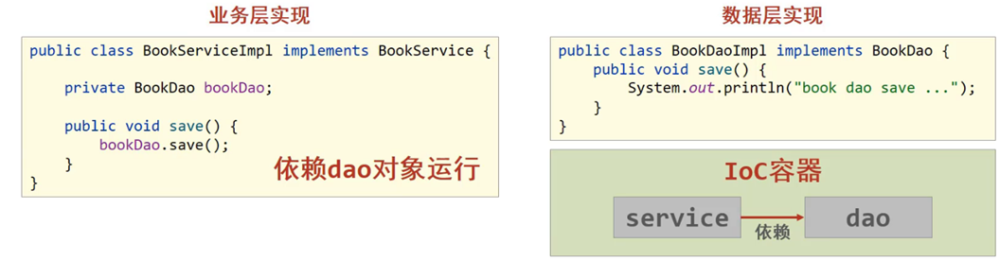
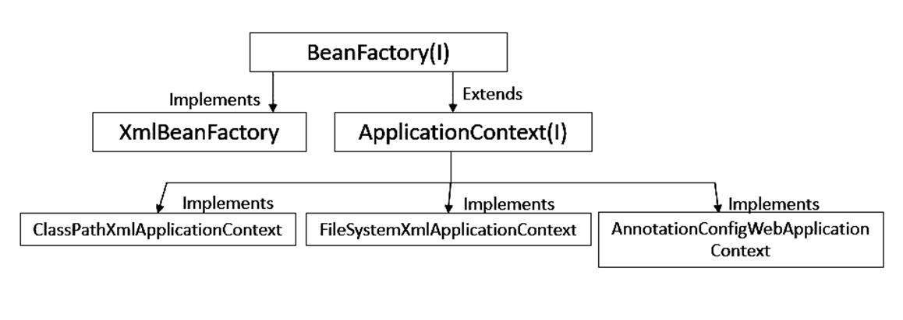
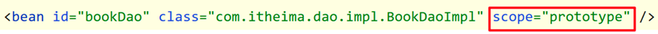
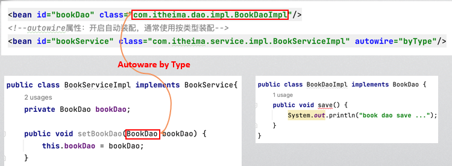
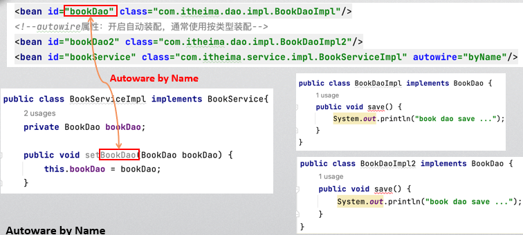
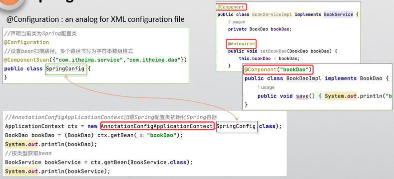
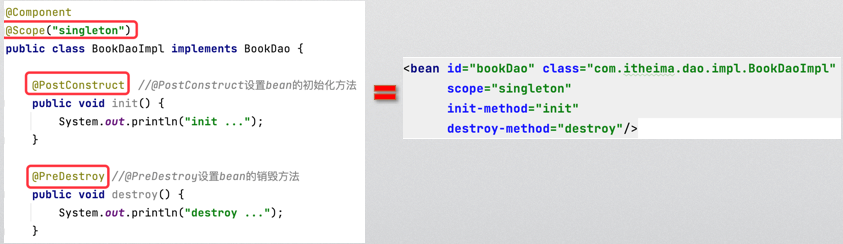
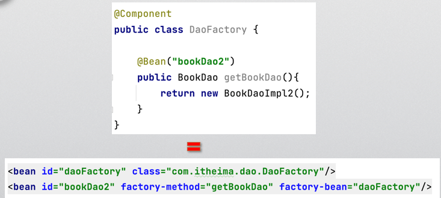
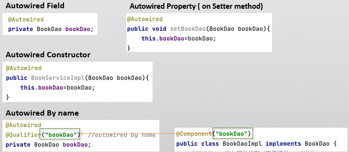
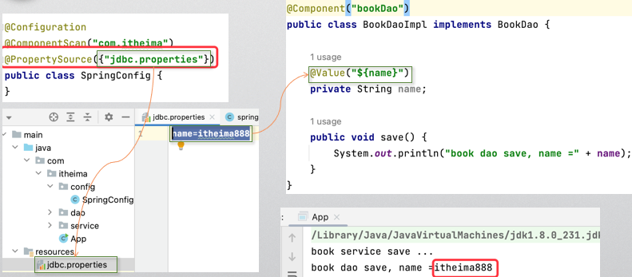

# note3

## Spring IOC容器

* 传统JavaSE：类内明确创建另一个类的对象，类层面依赖关系，依赖具体的类，属于紧耦合式编程。违背开闭原则（面向扩展开放，面向修改关闭）
* IOC：松耦合式，接口层面依赖关系。依赖接口，不依赖实现。

IOC帮助做初始化、创建等工作

每一个IOC容器里的对象都称作bean

bean之间可能有依赖关系，通过注入的方式



## 用Maven创建Spring项目

* 写pom.xml

  * 添加spring框架依赖

* 在resource文件夹下添加spring配置文件

  * 实现应用程序装配功能

* 在spring配置文件中创建bean，创建Java类

* 通过配置文件获取bean，创建IOC容器

  * Spring IOC 容器类

    

  * 加载Spring配置文件

    ```java
    // 法一：加载类路径下的配置文件
    ApplicationContext ctx = new ClassPathXmlApplicationContext("applicationContext.xml");
    
    // 法二：从文件系统下加载配置文件
    ApplicationContext ctx = new FileSystemXmlApplicationContext(
    "D:\\workspace\\spring_10_container\\src\\main\\resources\\applicationContext.xml");
    ```

  * 获取bean

    ```java
    // 法一：by name
    BookDao bookDao = (BookDao) ctx.getBean("bookDao");
    
    // 法二：by Name(Generic method)
    // 告诉类型，则不需要强制转换
    BookDao bookDao = ctx.getBean("bookDao",BookDao.class);
    
    //3. getBean by Type
    BookDao bookDao = ctx.getBean(BookDao.class);
    ```

## Spring bean的生命周期

### scope of beans



* scope = "singleton"（默认）
  * 每次get都是同一对象
* scope = "prototype"
  * 每次get创建新对象

注意：bean对应创建的类中不要定义有状态的东西，防止多个线程相互之间干扰

创建次序：先创建被依赖的，再创建依赖的

销毁次序：后创建的先销毁

## 依赖注入

### 属性注入（用setter）

property的“name”不是字段，而是setXXX方法中的XXX

### 构造函数注入

`<constructor-arg name="XXX" value="y"/>`

`<constructor-arg index=1 value="y"/>`

用index更不容易出错，用name可能有含糊的地方

### 注入集合

```xml
<property name="array">
	<array>
    	<value>100</value>
        <value>200</value>
    </array>
</property>
```

> 将业务逻辑层的类设置为Bean，不要将具体数值的类设置为Bean

### Autowired Injection

#### By Type



* `BookServiceImpl`这个类对应`bookService`这个bean
* bean中指定`autowire="byType"`，表示按类型自动装配，根据setter方法中的**参数类型（接口类**），**找到该类型对应的bean**，注入
* 如果该接口类存在多个实现类，则抛出`NoUniqueBeanDefinitionException`

#### By Name



* `BookServiceImpl`这个类对应`bookService`这个bean
* bean中指定`autowire="byName"`，表示按名称自动装配，根据setXXX方法名称中的XXX，**找到该名称对应的bean**，注入
* 如果找不到指定名称的bean，不注入

## Spring 注解

### 基本注解



* Spring配置类
  * `@configuration`
    * 对XML配置文件的模拟
    * 当前类为Spring配置类
  * `@ComponentScan({"com.itheima.service", "com.itheima.dao"})`
    * 设置bean扫描路径，多个路径书写为字符串数组格式
* 标注类为Spring容器的bean
  * `@Component`加在该类上
    * 配置一个bean。相当于配置了id
    * 声明这是个bean，可以被Spring扫描和初始化
  * `@Autowired`加在setter上
    * 自动根据**类型**注入

> `@Autowired`默认使用**byType**的方式注入
>
> ```java
> @Autowired
> private UserService userService;
> ```
>
> 这段代码会在初始化时，在spring容器中寻找一个**类型**为`UserService`的bean实体注入，关联到`userService`的引入上。
>
> 但若`UserService`这个接口存在多个实现类时，spring注入时会报错，抛出`org.springframework.beans.factory.BeanCreationException`。因为注入时发现有2个匹配的bean，不知道要注入哪一个。

### 其他注解







### 属性注入



* Spring配置类上加`@PropertySource`注解，指向属性文件
* 属性文件中，写明属性名称及其值
* 在对应类上加`@Component`注解，表明是bean，在该类的变量上加`@Value`注解，指向属性名称

## assignment3

1. `pom.xml`：添加spring framework依赖
2. 在resources文件夹下添加spring配置文件`applicationContext.xml`：告诉Spring的IoC容器应该如何创建并组装Bean
3. 
