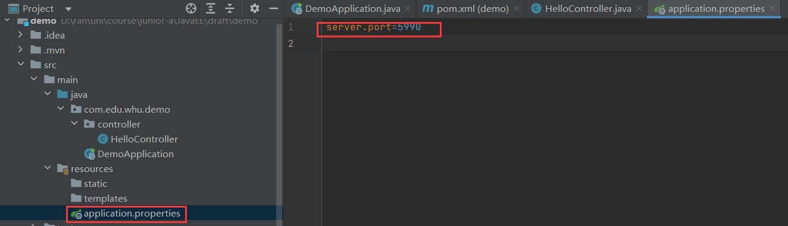
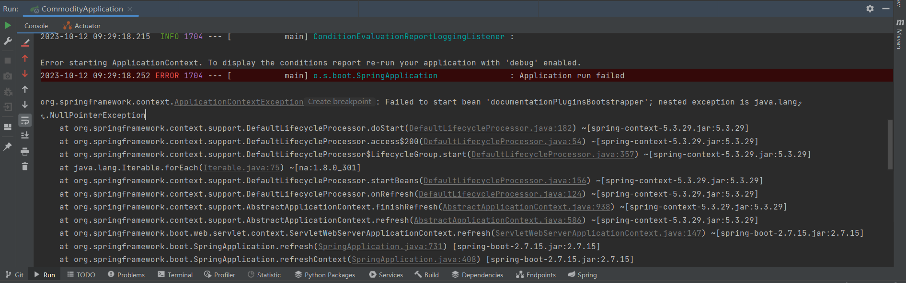

# note4-Spring Boot

## Web App Basics

基于HTTP协议向地址发请求，响应也基于HTTP协议

交互方式：请求响应

服务器生成一个HTML页面并返回给客户端，在客户端展示出来

缺点：

* 返回消息有大量冗余信息
* 跳转逻辑全在服务器端完成

后端代码在服务器完成，前端代码在浏览器完成

Spring Boot专门做后端开发

## Spring MVC

Spring Boot内嵌Tomcat等，用Spring Boot开发的程序可以直接运行

部署方便

在main方法上加`@SpringBootApplication`注解，会给应用开一个端口，可在浏览器访问端口从而访问应用

### a Rest API “hello world” with Spring Boot

* 从https://start.spring.io/生成项目至本地，在IDLE中打开

* maven 依赖安装
* 创建controller类
  * 创建方法，在方法上加注解`@GetMapping`

### SpringBoot Config File

1. `application.properties`

更改端口号：`server.port=XXXX`



2. `application.yaml`（推荐）：层次化

```yaml
server:
	port: 8888
	
demo:
	userName: wang
```

## Restful API

Rest是一种访问远程API的模式

`@controller`是MVC写法，不是直接返回数据，而是返回一个直接跳转到的页面

用SpringBoot开发，要写`@RestController`

get发出去的时候没有消息体；post需要带消息体


lombok做定制化注解处理，编译时自动化处理

`@Data`自动创建get,set方法

### RestController class

* 类注解
  * `@RestController`
  * `@RequestMapping("xxx")`
    * "XXX"前不需要加"/"
* 方法注解
  * `@GetMapping("/{id}")`
  * `@PostMapping("/{id}")`
  * `@PutMapping("/{id}")`
  * `@DeleteMapping("/{id}")`

## Vue + Rest API

Vue：基于MVVM模式的前端编程框架，支持http元素和JS对象之间的双向数据绑定。

Element-UI：提供一组UI组件的前端视图框架。

Axios：HTTP API客户端库

## assignment4

### RestAPI实现

配置pom.xml

创建controller, service, entity包

* 创建实体类Commodity
  * 类注解
    * `@Data`
    * `@ApiModel(description="商品实体")`
  * 属性注解
    * `@ApiModelProperty("商品编号")`
* 创建服务类CommodityService
  * 类注解
    * `@Service`
  * 创建存放商品的map
  * 创建增删改查函数
* 创建控制类CommodityController
  * 类注解
    * `@Api(tags = "商品管理")`
    * `@RestController`
    * `@RequestMapping("commodity")`
  * 添加属性：CommodityService对象
    * 属性注解
      * `@Autowired`
  * 添加方法
    * 方法注解
      * `@ApiOperation("XXX")`
      * `@PostMapping("")`
    * 参数注解
      * `@ApiParam("xxx")`
      * `@PathVariable("xx")`
* 创建应用程序类
  * 类注解
    * `@SpringBootApplication`

### Junit单元测试

SpringBoot引入单元测试

```xml
<dependency>
            <groupId>org.springframework.boot</groupId>
            <artifactId>spring-boot-starter-test</artifactId>
            <scope>test</scope>
        </dependency>
```

合理性检查测试（sanity check）：如果应用程序上下文不能启动，就会失败。

创建test/java/edu/whu/CommodityApplicationTest.java

* 类注解
  * `@SpringBootTest`：告诉Spring Boot寻找一个主配置类（例如用`SpringBootApplication`注解的类）
* 方法注解
  * `@Test`

> Mockito是一个Java框架，用于进行单元测试时模拟（mock）对象的行为。它通常用于测试中，以模拟外部依赖项的行为，例如数据库访问、网络请求、文件系统操作等，以便更容易地测试代码的功能，而不需要实际访问这些外部资源。
>
> Mockito 提供了一种方便的方式来创建虚拟对象（或称为模拟对象）以替代实际对象，然后定义这些虚拟对象的行为，使它们返回预定义的值或执行预定义的操作。这使得开发人员能够隔离要测试的单元，并**专注于测试代码的核心逻辑**，而不受外部依赖项的影响。
>
> Mockito的主要功能和用法包括：
>
> 1. **创建模拟对象**：使用Mockito可以轻松地创建模拟对象，代替实际的依赖项对象。
> 2. **定义模拟对象的行为**：您可以指定模拟对象应该如何响应方法调用，包括返回预定义的值或抛出预定义的异常。
> 3. **验证方法调用**：Mockito允许您验证模拟对象的方法是否按预期被调用，包括调用的次数、顺序等。
> 4. **Spy对象**：除了模拟对象外，Mockito还支持Spy对象，这是对实际对象的部分模拟，允许您保留对象的原始行为，并对其部分方法进行模拟。

#### 第一段测试代码 - `CommodityControllerTest`

单元测试，用于测试控制器和服务方法的独立行为

1. **测试目标**：测试`CommodityController`中的各种控制器方法（如添加商品、删除商品、获取商品等）的行为。测试主要集中在==控制器方法==的单元测试上。
2. **使用对象**：使用==Mockito==来模拟`CommodityService`的行为，以隔离控制器与服务层的依赖。
3. **Mockito的使用**：使用`when`和`thenReturn`来模拟服务方法的行为，以确保在不依赖实际服务实现的情况下进行测试。
4. **主要关注**：主要关注控制器方法的行为，如HTTP响应的状态码、响应体等，以确保控制器在各种情况下都能正确响应请求。

#### 第二段测试代码 - `CommodityMockMvcTest`

集成测试，用于测试控制器的端到端行为，包括HTTP请求和响应

1. **测试目标**：测试通过HTTP请求模拟控制器的行为。测试主要集中在==模拟HTTP请求和验证控制器==的集成测试上。
2. **使用对象**：使用Spring Boot的==MockMvc==来模拟HTTP请求，以与控制器进行交互。
3. **模拟HTTP请求**：使用MockMvc执行HTTP请求（GET和POST请求），以测试控制器的不同功能。
4. **主要关注**：主要关注控制器的端到端行为，即HTTP请求和响应。它测试了控制器的路由、请求处理和响应内容，并检查HTTP状态码以确保控制器的REST端点按预期工作。

### 错误解决

swagger 3与Spring boot的版本兼容问题



创建java/resources/application.yaml

```yaml
spring:
  mvc:
    pathmatch:
      matching-strategy: ant_path_matcher
```

### 上课讲评

注意点：

* 线程安全
* 写了三个测试
  * `ProductApiTest`：接口测试（集成测试）。需要把环境运行起来，发消息调用接口，看接口调用得怎么样
  * `ProductControllerTest`：接口测试。MockMvc模拟http请求
    * 将ProductService注入到测试用例里面
  * `ProductControllerMockTest`：单元测试。将所依赖的bean做成MockBean，不需要测试它们。

