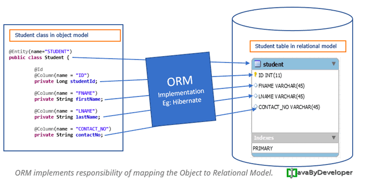
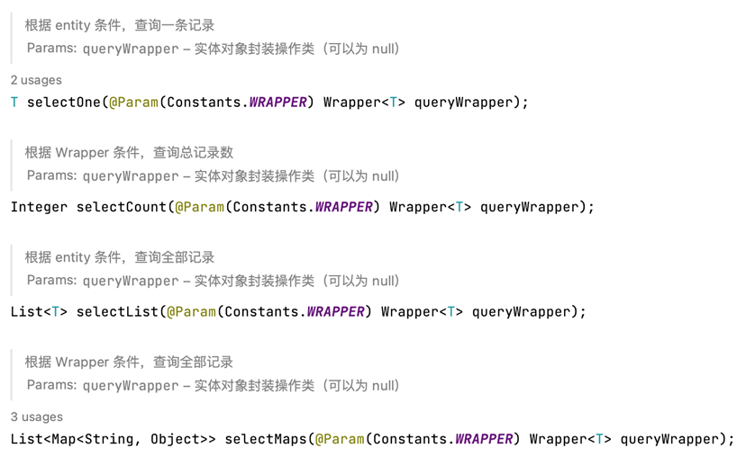
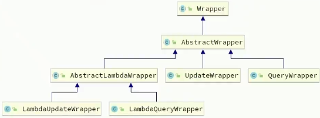
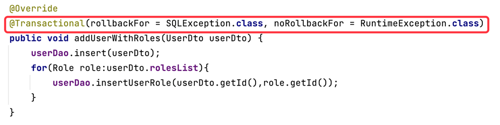
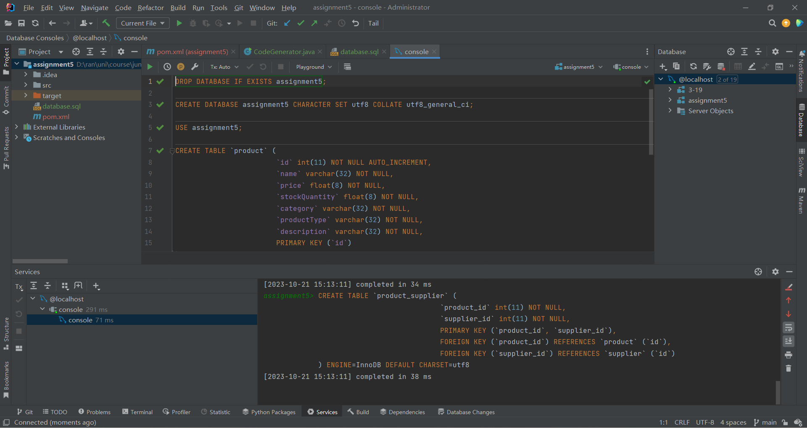
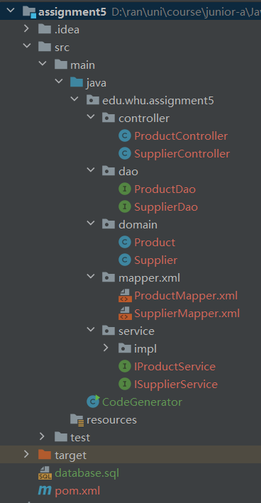
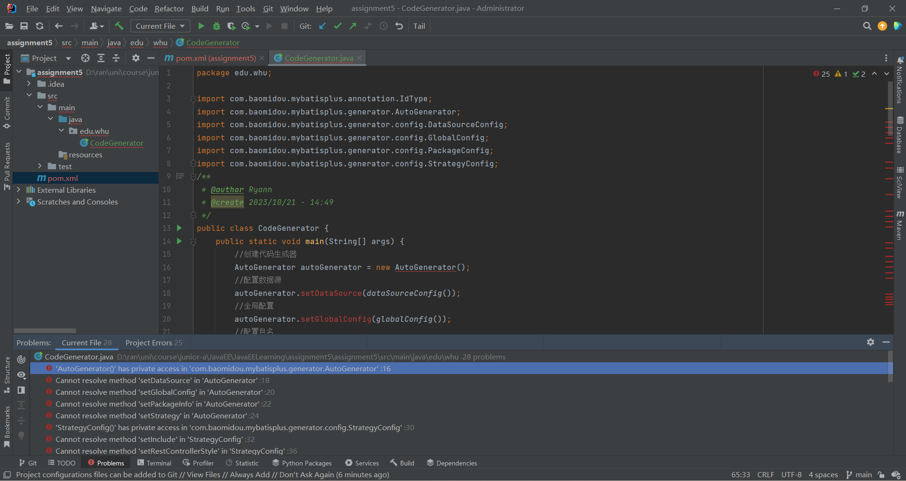

# note5-Mybatis-plus

## 1 Spring Data

### Spring Data

JDBC专门通过`sql`语句访问底层数据库

MyBatis与JPA并列，底层都基于JDBC

### Object Relational Mapping (ORM)

OR映射框架



* 将对象映射为关系模型
* 通过ORM，程序员可以以OO的方式访问数据库
* JPA (含Hibernate )和Mybatis都是ORM框架

## 2 Mybatis

Mybatis是什么：

* 一种流行的ORM框架

* 程序员通过编写**SQL语句**，可以将**参数和结果**与**实体对象**进行映射

* **持久层**框架，用于简化JDBC开发，CRUD

  > 持久层：负责将数据保存到**数据库**的那一层代码
  >
  > JavaEE三层架构：表现层（页面展示）、业务层（逻辑处理）、持久层（保存到数据库）

  > JDBC缺点：
  >
  > * 硬编码：将字符串信息写入代码，字符串有可能需要改动
  >   * 如注册驱动，获取连接
  >   * 如SQL语句
  > * 操作繁琐
  >   * 手动设置参数
  >   * 手动封装结果集
  >
  > 因此，MyBatis分别通过**配置文件**（将字符串、SQL语句写入配置文件，读取配置文件）和自动完成来解决以上两个缺点的问题

Mybatis的核心思想：将SQL查询与Java代码分离。编写原生的SQL查询，将它们保存在**XML文件或注解**中，然后使用Mybatis来执行这些查询，将结果映射到Java对象。这种分离使得维护和修改SQL查询更加容易。

在`application.yaml`文件中配置

注意点：

* 保证MySql是开着的

* 创建的database和表的字符集注意用utf8


* `User`类

  * 表要求有主键，所以写的类也要有主键字段，如`@TableId(type = IdType.ASSIGN_ID)`
  * 使用：
    * user.setName("xx")

* `UserMybatisMapper`类

  * `#{id}`使用的是参数user的id

    ```java
    @Insert("INSERT INTO user(id, name, password, age, tel) VALUES(#{id}, #{password}, #{age}, #{tel})")
    void insert (User user)
    ```

## 3 MyBatis-plus

> 官网文档：https://baomidou.com/pages/24112f/#%E7%89%B9%E6%80%A7

MyBatis-plus是什么：

- 对Mybatis的扩展，以简化Mybatis

- 保留了Mybatis的所有特征

- 内置Mapper for CRUD，无需SQL

  - 写一个接口继承`BaseMapper`

    ```java
    @Mapper
    public interface UserMybatisPlusMapper extends BaseMapper<User> {}
    ```

  - `BaseMapper`的查询方法

    

- 内置分页

  - 为减少数据传输，要做分页
    * 前端分页
    * 后端分页（建议）

- 易于使用的Query Wrapper

- 面向DB - first开发的代码生成器

### 基本步骤

1. 引入起步依赖：继承了Mybatis和MybatisPlus的所有功能，实现自动装配效果

   ```xml
   <dependency>
       <groupId>com.baomidou</groupId>
       <artifactId>mybatis-plus-boot-starter</artifactId>
       <version>3.5.3.1</version>
   </dependency>
   ```

2. 定义Mapper：自定义的Mapper继承MybatisPlus提供的`BaseMapper`接口

   * <u>指定泛型为实体类类型</u>

3. 使用Mapper：

   * mapper.insert(user);
   * mapper.selectList(null);

### Entity Annotations

MyBatisPlus通过扫描实体类，并基于反射获取实体类信息作为数据库表信息

MyBatisPlus如何知道数据库表信息：

* 类名驼峰转下划线作为表名

* 名为`id`的字段作为主键

* 变量名驼峰转下划线作为表的字段名

常见注解：

* 类注解
  * 表名：`@TableName(value = "user")`
* 属性注解
  * 表主键：`@TableId(type = IdType.ASSIGN_ID)`
    * `value="id"`
    * `type=IdType.xxx`
      * `IdType`枚举
        * `AUTO`：自增（告诉MybatisPlus不要给id赋值，而是交给数据库处理）
        * `INPUT`：通过set方法自行输入
        * `ASSIGN_ID`：分配ID
  * 表的普通字段：`@TableField`
    * 使用场景：
      * 成员变量名与数据库字段名不一致
      * 成员变量名以`is`开头，且是布尔值
      * 成员变量名与数据库关键字冲突（如order）
      * 成员变量不是数据库字段
    * 用法
      * select = false：查询时字段将不会被选择`@TableField(value="pwd", select=false)`
      * exist = false：字段不会存储在数据库中`@TableField(exist = false)`

### 常见配置

MyBatisPlus继承了MyBatis原生配置和一些自己特有的配置

除了别名扫描包，其他都有默认配置，不需要自己配

在`application.yaml`中配置：

```yaml
mybatis-plus:
	type-aliases-package: com.itheima.mp.domain.po # 别名扫描包
	mapper-locations: "classpath*:mapper/**/*.xml" # Mapper.xml文件地址，默认值
	configuration:
		map-underscore-to-camel-case: true # 是否开启下划线和驼峰的映射
		cache-enabled: false # 是否开启二级缓存
	global-config:
		db-config:
			id-type: assign_id # id为雪花算法生成
			update-strategy : not_null # 更新策略:只更新非空字段
```

### 条件构造器

MyBatisPlus支持各种复杂的**where条件**，可以满足日常开发的所有需求

`Wrapper`即条件构造器



QueryWrapper和LambdaQueryWrapper通常用来构建select, delete, update的where条件部分

UpdateWrapper和LambdaUpdateWrapper通常只有在set语句比较特殊时才使用

#### QueryWrapper

##### 基于QueryWrapper的查询

```java
// 1. 构建查询条件
QueryWrapper<User> wrapper = new QueryWrapper<User>()
    	.select("id", "username", "info", "balance")
    	.like("username", "o")
    	.ge("balance", 1000);
// 2. 查询
List<User> users = userMapper.selectList(wrapper);
users.forEach(System.out::println);
```

##### 基于QueryWrapper的更新

1. 要更新的数据（即set）

   ```java
   User user = new User();
   user.setBalance(2000);
   ```

2. 更新的条件（即where）

   ```java
   QueryWrapper<User> wrapper = new QueryWrapper<User>().eq("username", "jack");
   ```

3. 执行更新

   ```java
   userMapper.update(user, wrapper);
   ```

#### UpdateWrapper

##### 基于UpdateWrapper的更新

```java
List<Long> ids = List.of(1L, 2L, 4L);
UpdateWrapper<User> wrapper = new UpdateWrapper<User>()
    .setSql("balance = balance - 200")  // set条件
    .in("id", ids);  // where条件
userMapper.update(null, wrapper);  // 不需要在参数1写更新的内容，直接在wrapper里写
```

#### LambdaQueryWrapper

##### 基于LambdaQueryWrapper的查询

解决字符串硬编码问题

```java
// 1. 构建查询条件
LambdaQueryWrapper<User> wrapper = new LambdaQueryWrapper<User>()
    	.select(User::getId, User::getUsername, User::getInfo, User::getBalance)  // 传的是函数。因为获得了get函数就可以根据反射获取字段
    	.like(User::getUsername, "o")
    	.ge(User::getBalance, 1000);
// 2. 查询
List<User> users = userMapper.selectList(wrapper);
users.forEach(System.out::println);
```

#### Composite Condition 条件组合

* 并且关系
  * 13-16岁之间：`lqw.lt(User::getAge, 16).gt(User::getAge, 13);`
* 或者关系
  * 小于13岁获大于14岁：`lqw2.lt(User::getAge, 13).or().gt(User::getAge, 14);
* 多条件随机组合
  * 参数name和age不为null时，连接当前条件：`lqw3.lt(null != name, User::getName, name).gt(null != age, User::getAge, age);`

#### 投影

如，查询条件明确指定只查询 `id`, `name`, 和 `age` 字段，最终的查询结果也只包含这些字段的数据

```java
LambdaQueryWrapper<User> lqw = new LambdaQueryWrapper<User>();
lqw.select(User::getId,User::getName,User::getAge);
List<User> userList = mapper.selectList(lqw);
```

#### Aggregation 聚合

* `selectCount` 方法执行查询操作，这是一个聚合操作，计算满足条件的**记录数量**。

```java
QueryWrapper<User> lqw = new QueryWrapper<User>();
lqw.lambda().gt(User::getAge,13);
assertEquals(3,mapper.selectCount(lqw)); // 求和
```

* 使用 `select` 方法指定了聚合操作，即 `count(*)`，用于计算满足条件的记录数量。查询结果将以 `count` 别名存储在结果集中。`mapper.selectMaps(lqw);` 执行了查询操作，返回了一个包含查询结果的列表，每个结果是一个 **Map 对象**，其中包含了别名为 `count` 的值

  ```java
  lqw = new QueryWrapper<User>();
  lqw.gt("age",13).select("count(*) as count");
  List<Map<String, Object>> result = mapper.selectMaps(lqw);
  assertEquals(1,result.size());
  assertEquals(3L,result.get(0).get("count"));
  ```

* 使用 `select` 方法指定了聚合操作，即 `max(age)`，用于计算满足条件的记录中年龄的最大值。查询结果将以 `maxAge` 别名存储在结果集中。`result = mapper.selectMaps(lqw);` 执行了查询操作，返回了一个包含查询结果的列表，每个结果是一个 **Map 对象**，其中包含了别名为 `maxAge` 的值。

  ```java
  lqw = new QueryWrapper<User>();
  lqw.gt("age",13).select("max(age) as maxAge");
  result = mapper.selectMaps(lqw);
  assertEquals(1,result.size());
  assertEquals(15,result.get(0).get("maxAge"));
  ```

#### Grouping 分类汇总

如，使用 `groupBy` 方法指定按 `age` 字段进行分组。查询结果将按年龄进行分组，每个年龄段的记录数量将被汇总。`mapper.selectMaps(lqw);` 执行查询操作，返回一个包含查询结果的列表，每个结果是一个 Map 对象，每个 `Map` 对象会包含两个键值对（键为 "age"和键为 "count"）：

```java
QueryWrapper<User> lqw = new QueryWrapper<User>();
lqw.lambda().gt(User::getAge,13);
//分类汇总
lqw.select("age,count(*) as count");
lqw.groupBy("age");
List<Map<String, Object>> map = mapper.selectMaps(lqw);
assertEquals(2,map.size());
```

### 分页、排序

1. 定义配置类

   ```java
   @Configuration
   public class MpConfig {
       @Bean
       public MybatisPlusInterceptor mpInterceptor(){
           //1.定义Mp拦截器
           MybatisPlusInterceptor mpInterceptor = new MybatisPlusInterceptor();
           //2.添加具体的拦截器
           mpInterceptor.addInnerInterceptor(new PaginationInnerInterceptor());
           return mpInterceptor;
       }
   }
   ```

2. 使用

   ```java
   // 【方式一】IPage对象封装分页排序的条件
   IPage page  = new Page(1,2)  // 创建分页对象。new Page(1, 2)表示查询第1页（页码从1开始）的结果，每页显示2条记录
       .addOrder(OrderItem.asc("age"));   // 指定按age字段升序
   mapper.selectPage(page, null);  // 执行分页查询操作。将查询结果存储在page对象中
   
   assertEquals(2,page.getRecords().size()); // 获得查询结果数目
   assertEquals(1,page.getCurrent());// 获得当前页码
   assertEquals(2,page.getSize()); // 获得每页记录数
   assertEquals(2,page.getPages());// 获得页数
   assertEquals(4,page.getTotal());// 获得记录总数
   
   
   // 【方式二】LambdaQueryWrapper指定查询排序的条件
   LambdaQueryWrapper<User> lwq = new LambdaQueryWrapper<>();  // 构建查询条件
   lwq.like(User::getName,"黑马");  // 指定查询条件
   lwq.orderByAsc(User::getAge);   // 指定按age字段升序
   IPage page2  = new Page(1,2);
   mapper.selectPage(page2, lwq);
   
   assertEquals(2,page2.getRecords().size()); // 获得查询结果数目
   assertEquals(1,page2.getCurrent());// 获得当前页码
   assertEquals(2,page2.getSize()); // 获得每页记录数
   assertEquals(2,page2.getPages());// 获得页数
   assertEquals(4,page2.getTotal());// 获得记录总数
   ```

### 示例代码-`mybatis-plus-demo`要点

* 测试类上加`@SpringBootTest`和`@Transactional`

  * `@SpringBootTest`的作用：可以自动启动SpringBoot，以支持依赖注入
  * `@Transactional`作用：每个Test方法执行完成后，自动回滚事务，数据库变空。

* mapper对象上加`@Autowired`

* 使用Lambda语法。可以避免列名出错

  * > 使用了lambda表达式 可以通过**方法引用**的方式来使用实体字段名的操作，避免直接写数据库表字段名时的错写名字

  * `qw.lambda().gt(User::getAge, 13);` 

    * 使用 `QueryWrapper`对象 创建了一个 lambda 查询条件，表示要查询 `User` 表中年龄大于 13 的记录。
    * `.gt(User::getAge, 13)` 意味着 "greater than"，即大于 13。这个查询条件被添加到 `qw` 对象中

  * `lqw.like(User::getName, "黑马");` 

    * 使用 `LambdaQueryWrapper` 对象创建了一个 lambda 查询条件，表示要查询 `User` 表中名字包含 "黑马" 的记录。
    * `.like(User::getName, "黑马")` 表示模糊匹配名字中包含 "黑马" 的记录。

### 分页插件（黑马程序员教程）

在配置类中注册MyBatisPlus的核心插件，同时添加分页插件

使用分页的API

1. 定义配置类

   ```java
   public class MyBatisConfig {
       @Bean
       public MybatisPlusInterceptor mybatisPlusInterceptor() {
           // 1. 定义Mp拦截器
           MybatisPlusInterceptor interceptor = new MybatisPlusInterceptor();
           // 2. 创建分页插件
           PaginationInnerInterceptor paginationInnerceptor = new PaginationInnerInterceptor(DBType.MYSQL);
           paginationInnerInterceptor.setMaxLimit(1000L);
           // 3. 添加具体的拦截器，即添加分页插件
           interceptor.addInnerInterceptor(paginationInnerInterceptor);
           return interceptor;
       }
   }
   ```

2. 使用分页工具

   ```java
   ing pageNo = 1, pageSize = 2;
   // 1. 准备分页条件
   // 1.1 分页条件
   Page<User> page = Page.of(pageNo, pageSize);
   // 1.2 排序条件
   page.addOrder(new OrderItem("balance", true));  // true是升序
   page.addOrder(new OrderItem("id", true));
   
   // 2. 分页查询
   Page<user> p = userService.page(page);
   
   // 3. 解析
   long total = p.getTotal();
   long pages = p.getPages(); // 总页数
   List<User> users = p.getRecords();
   users.forEach(System.out::println);
   ```

## 3 Code Generation

Mybatis - plus有根据数据库生成代码的工具

> 可以直接在IDEA中找插件

#### 代码生成器（旧）

适用版本：mybatis-plus-generator 3.5.1 以下版本

使用：

1. 添加代码生成器依赖

   ```xml
   <dependency>
       <groupId>com.baomidou</groupId>
       <artifactId>mybatis-plus-generator</artifactId>
       <version>3.4.1</version>
   </dependency>
   ```

2. 添加模板引擎依赖。MyBatis-Plus 支持 Velocity（默认）

   ```xml
   <dependency>
       <groupId>org.apache.velocity</groupId>
       <artifactId>velocity-engine-core</artifactId>
       <version>2.3</version>
   </dependency>
   ```

在 MyBatis-Plus 中，`IService` 表示基于 MyBatis-Plus 框架的 Service 层接口。它提供了一组用于数据访问和业务逻辑的通用方法，用于执行 CRUD（创建、读取、更新、删除）操作，以及一些查询方法，以简化数据访问层的开发。

* 定义接口，继承`IService`并添加**泛型**：

  `public interface IUserService extends IService<User>`

* 定义接口实现类，继承`ServiceImpl`并添加**泛型** + 实现自定义的接口，添加`@Service`：

  ```java
  @Service
  public class UserServiceImpl extends ServiceImpl<UserDao, User> implements IUserService
  ```

## 4 Transaction

### ACID特性

* 原子性（Atomicity）
  * 指事务是一个不可分割的工作单位，事务中的操作要么全部成功，要么全部失败。比如在同一个事务中的SQL语句，要么全部执行成功，要么全部执行失败。

```mysql
begin transaction;
    update account set money = money-100 where name = '张三';
    update account set money = money+100 where name = '李四';
commit transaction;
```

* 一致性（Consistency）
  * 官网上事务一致性的概念是：事务必须使数据库从一个一致性状态变换到另外一个一致性状态。
  * 换一种方式理解就是：事务按照预期生效，数据的状态是预期的状态。

* 隔离性（Isolation）
  * 多个用户并发访问数据库时，数据库为每一个用户开启的事务，不能被其他事务的操作数据所干扰，多个并发事务之间要相互隔离。
* 持久性（Durability）
  * 指一个事务一旦被提交，它对数据库中数据的改变就是永久性的，接下来即使数据库发生故障也不应该对其有任何影响。
  * 例如我们在使用JDBC操作数据库时，在提交事务方法后，提示用户事务操作完成，当我们程序执行完成直到看到提示后，就可以**认定事务以及正确提交**，即使这时候数据库出现了问题，也必须要将我们的事务完全执行完成，否则就会造成我们看到提示事务处理完毕，但是数据库因为故障而没有执行事务的重大错误。

###  **@Transactional**

#### 背景

Spring为事务管理提供了丰富的功能支持。Spring事务管理分为编码式和声明式的两种方式:

- 编程式事务
  - 允许用户在代码中精确定义事务的边界。
  - 编程式事务管理使用TransactionTemplate或者直接使用底层的PlatformTransactionManager。
  - 对于编程式事务管理，spring推荐使用TransactionTemplate。
- 声明式事务
  - 基于AOP，有助于用户将操作与事务规则进行解耦。其本质是对方法前后进行拦截，然后在目标方法开始之前创建或者加入一个事务，在执行完目标方法之后根据执行情况提交或者回滚事务。
  - 有两种常用的方式
    - 在配置文件(xml)中做相关的事务规则声明
    - 基于@Transactional注解的方式：更简单易用、清爽。

#### 注意点

`@Transactional`可以作用于接口、接口方法、类以及类方法上。

当作用于类上时，该类的所有 public 方法将都具有该类型的事务属性，同时，我们也可以在方法级别使用该标注来**覆盖**类级别的定义。

Spring建议不要在接口或者接口方法上使用`@Transactional`，因为这只有在使用基于接口的代理时它才会生效。

`@Transactional`尽量直接加在方法上的原因：

* `@Transactional`直接加在类或者接口上，`@Transactional`会对类或者接口里面所有的public方法都有效(相当于所有的public方法都加上了`@Transactional`，而且注解带的参数都是一样的)。
* 影响性能，可能有些方法不需要`@Transactional`
* 方法不同，可能`@Transactional`需要配置的参数也不同，比如有一个方法只是做查询操作，那可能需要配置`@Transactional`的`readOnly`参数。

`@Transactional`应该只被应用到 public 方法上，这是由Spring AOP的本质决定的。如果在protected、private或默认可见性的方法上使用`@Transactional`，将被忽略，也不会抛出任何异常。

`@Transactional`内部实现依赖于Spring AOP编程。而AOP在默认情况下，只有来自外部的方法调用才会被AOP代理捕获，也就是，类内部方法调用本类内部的其他方法并不会引起事务行为，即使被调用方法使用`@Transactional`进行修饰。

> AOP：面向切面编程。AOP 的作用就是保证开发者在不修改源代码的前提下，为系统中的业务组件添加某种通用功能

`@Transactional`用来设置事务的传播行为、隔离规则、回滚规则、事务超时、是否只读

> “有@Transactional的函数之间调用的情况”这一问题参考https://www.jianshu.com/p/befc2d73e487

#### 针对特定异常回滚



#### @Transactional in Junit

在测试类上添加`@Transactional`，每个测试方法执行完后，数据库都回滚一次，保障每个测试方法不留下垃圾数据


### 示例代码-`spring-boot-transaction`要点

服务实现类`UserServiceImpl`：

1. `@Transactional`表示方法或类中的操作应该在事务管理的范围内执行。如果在方法执行期间发生**异常**，事务将回滚，即所有数据库操作都将被**撤销**。
2. `userDao.insertUserRole(userDto.getId(), role.getId())` 将用户和角色之间的关联关系插入到数据库中。
3. `addUserWithRoles2(UserDto userDto)`方法没有被标记为 `@Transactional`，这意味着其中的数据库操作不在事务管理的范围内。如果在执行这个方法的过程中发生异常，数据库操作不会回滚，即已经执行的操作将保留在数据库中。

## assignment5

### 完成过程

1. 尝试从数据库生成Mybatis-plus代码

   1. 在项目顶端目录下编写SQL脚本

      1. IDEA配置datasource

      2. 编写创建数据库和数据表的脚本

      3. 执行

         

   2. 添加代码生成器和velocity依赖

      ```xml
      <dependency>
                  <groupId>com.baomidou</groupId>
                  <artifactId>mybatis-plus-generator</artifactId>
                  <version>3.4.1</version>
              </dependency>
              <dependency>
                  <groupId>org.apache.velocity</groupId>
                  <artifactId>velocity-engine-core</artifactId>
                  <version>2.3</version>
              </dependency>
      ```

   3. 在src/main/java目录下创建`CodeGenerator`类，执行生成操作

      项目结构：

      

   4. 在Dao相关接口类上添加`@Mapper`

   5. 引入springboot相关依赖

2. 尝试各种形式的查询操作

   1. 创建应用程序类MybatisPlusApplication
   2. 实现`ProductServiceImpl`类

### 错误解决

1. 导入代码生成器和velocity依赖时报错：'AutoGenerator()' has private access in 'com.baomidou.mybatisplus.generator.AutoGenerator'



解决：参考https://blog.csdn.net/qq_42102911/article/details/123493860。mybatis-plus-generator依赖和mybatis-Plus版本不兼容，我把mybatis-plus-generator依赖 换成 3.3.0，就可以了

2. 运行`CodeGenerator`类的main方法时报错：SLF4J: Failed to load class "org.slf4j.impl.StaticLoggerBinder".
   SLF4J: Defaulting to no-operation (NOP) logger implementation

解决：参考https://www.cnblogs.com/fangjb/p/12964710.html。添加依赖：

```xml
<dependency>
            <groupId>org.slf4j</groupId>
            <artifactId>slf4j-simple</artifactId>
            <version>1.7.25</version>
            <scope>compile</scope>
        </dependency>
```

3. 运行`CodeGenerator`类的main方法时报错：Exception in thread "main" java.lang.RuntimeException: java.lang.ClassNotFoundException: com.mysql.cj.jdbc.Driver

解决：参考https://blog.csdn.net/wxplol/article/details/109155740。下载jdbc驱动并导入项目

4. 运行`CodeGenerator`类的main方法时警告：

5. [main] WARN org.apache.velocity.deprecation - configuration key 'file.resource.loader.unicode' has been deprecated in favor of 'resource.loader.file.unicode'
   [main] WARN org.apache.velocity.deprecation - configuration key 'file.resource.loader.class' has been deprecated in favor of 'resource.loader.file.class'

   不妨碍生成，则未解决

6. 测试分页排序方法时，getPages()和getTotal()返回值都为0

解决：参考https://blog.csdn.net/m0_56164246/article/details/123280740

原因为未设置Mp拦截器
