# note6-Spring AOP

> maven项目在idea中无法加载时，右击pom.xml，选择"add as maven project"

## 1  Aspect Oriented Programming

关注点分离

**背景**：

只有面向对象开发方式、无AOP时：安全检查、事务机制、日志机制等相似的操作分散在众多代码中，无法作为单独的模块单独使用。这种常出现在很多地方的关注点称为横切关注点，代码混杂在一起，可读性差。从而出现**面向切面编程（AOP）**

**AOP思想**：

将横切关注点分为多个aspect，每个aspect中的每个方法叫做advice

当需要时，动态地编织到模块中。插入的具体位置称作joinpoint（连接点），指具体的某个方法

不能直接调原来对象，只能调代理对象，即先执行advice，再调用目标对象。通过创建代理对象，拦截了直接调用目标对象的请求。

**各种概念的区分**：

* aspect 切面：
  * 是一个类。
  * 定义了在何处（连接点）和何时（通知）应该执行特定的操作
  * 包含许多通知
* advice 通知：是切面的行为。定义在何时和何处执行切面代码
* pointcut 切入点：
  * 指定aspect将被执行的位置，即将切入点定义为匹配哪些**服务层方法**
  * 是表达式，描述连接点的选择标准
  * 定义了一组连接点，从而确定了advice在何处执行
  * 切入点是连接点的逻辑描述

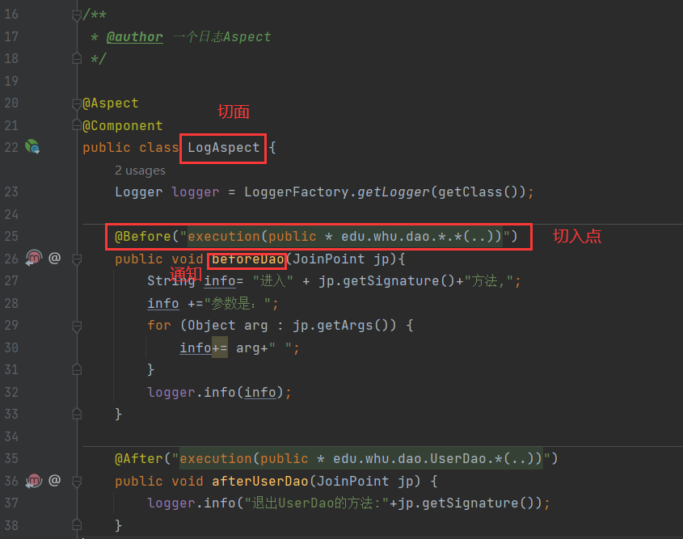

## 2  Hello, Spring AOP

引入aop依赖：

```xml
<dependency>
	<groupId>org.springframework.boot</groupId>
    <artifactId>spring-boot-starter-aop</artifactId>
</dependency>
```

写一个`LogAspect`类，注解包括`@Aspect`

记日志方式：logger对象

`*`指任意类型；包名；`()`前是方法名；`(..)`指任意参数

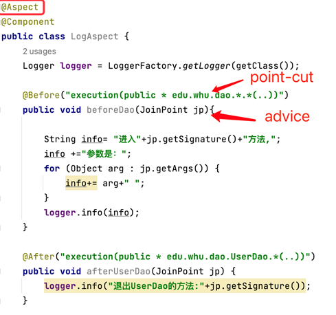

对spring-aop-hello项目进行测试：

* 调用UserService实现类的register方法
  * register方法调用userDao方法和bookDao方法
    * 自定义的LogAspect类中，定义了各种通知

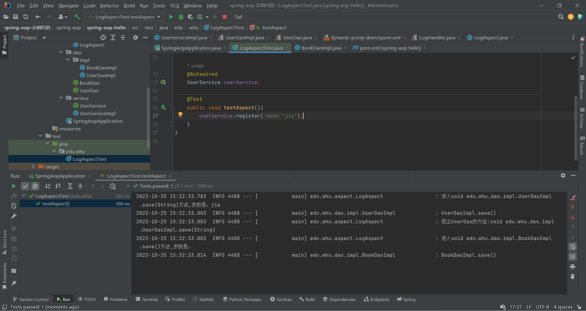

## 3  How does Spring AOP work?

### **BeanPostProcessor of** **Spring** 

Spring在Bean初始化后进行后置处理，根据需要为bean创建AOP代理对象。

> Spring AOP中创建代理对象的主要目的：将切面的行为（通知）插入到目标对象的方法调用中，以实现横切关注点的管理和控制。

## 4 Pointcuts切点

实际上是表达式、字符串

满足表达式的**方法**都会被拦截。表达式有许多种：

- execution (matchs methods)
  - 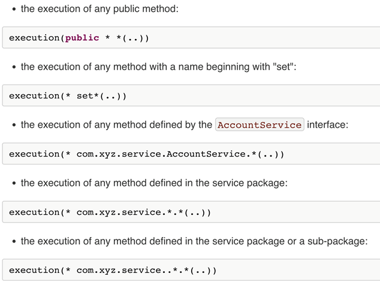
  - 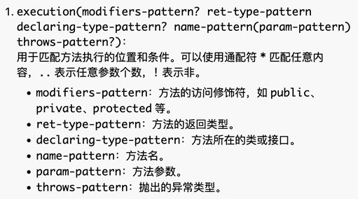

- within （matchs classes）：根据类来匹配。该类下的所有方法都能匹配
  - 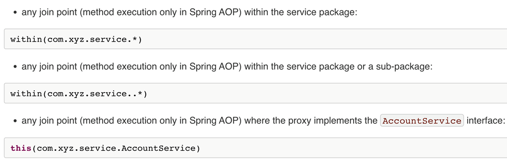

- this (matchs classes)
- target (matchs classes)
- args (matchs arguments)
- bean(matchs beans) 
  - 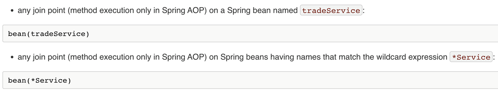

- @annotation (matchs methods), @target(matchs classes), @args
  - 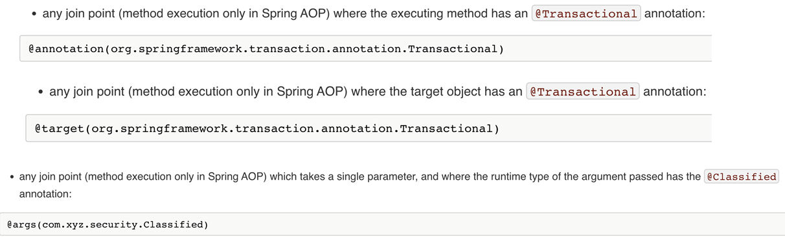

- composite
  - 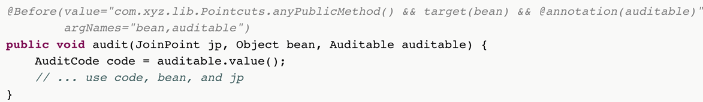


## 5 Advices

`@Around`替换了目标方法。**只要有`@Around`，它就是最先被捕获的**。

`ProceedingJoinPoint`指待处理的joinpoint，这个参数包含了关于被拦截方法的信息，允许进行相应控制

- @Before 

  - declares the before advice. It is applied before calling the actual method.

- @After 

  - declares the after advice. It is applied after calling the actual method and before returning result.

- @AfterReturning

  - It is applied after calling the actual method and before returning result. But you can get the result value in the advice.

  - 在切点方法返回后执行。

  - 如：

    ```java
     @AfterReturning(pointcut = "servicePointCut()", returning = "ret")
        public Object afterPointCutReturn(JoinPoint jp,Object ret) {
            logger.info("afterReturning:返回值为："+ret);
            return ret;
        }
    ```

    方法`afterPointCutReturn`将在切点方法返回后执行。

    `returning = "ret"`指示被切面拦截的方法的返回值应该存储在`ret`参数中。`afterPointCutReturn`方法可以访问这个返回值并对它进行操作。

- @Around 

  - It is applied before and after calling the actual method.
  - 可以用来计时方法调用时间

- @AfterThrowing

  - declares the throws advice. It is applied if actual method throws exception.

### Advice执行次序

spring-aop-detail项目的测试类DemoAspectTest触发过程：

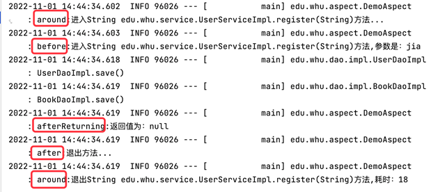

### 异常

`@AfterThrowing`

拦截异常，获取异常信息

如spring-aop-detail项目的DemoAspect中：

```java
@AfterThrowing(pointcut= "servicePointCut()",throwing="ex")
    public void afterPointCutThrow(JoinPoint jp,Exception ex) {
        logger.error("afterThrowing:异常为："+ex);
    }
```

测试方法：

```java
@Test
    public void testAfterThrowing(){
        assertThrows(RuntimeException.class, () -> {
            userService.register(null);
        });
    }
```

测试结果：

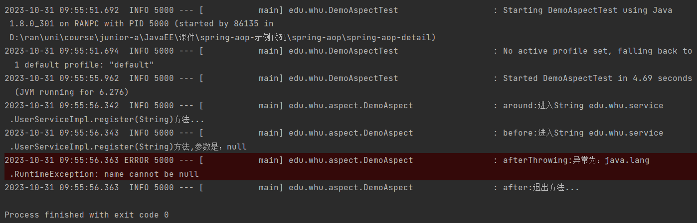

### 示例：计时器（spring-aop-detail-StopWatchAspect类）

计算执行时间

`proceed()`的返回值要return出去，否则拦截之后会报错

## 6 Global Exception Handling

* 正常的消息，return；
* 异常消息，封装
  * 简化异常处理的代码
  * 拦截controller的异常，构建`ResponseEntity<ExceptionResponse>`对象，并返回

泛型是类型安全的

前端通过HTTP状态码区分正确和错误消息，并对它们进行不同的处理。成功状态码是200，失败是400。

原则上，正确和错误消息不需要采用统一的格式。

## assignment6

### 完成记录

* 添加全局异常检测
  * assignment5的controller中的所有方法都返回`ResponseEntity<Result<T>>`, 使用全局异常检测后可以简化代码
  * exception包：定义异常类和GlobalExceptionHandler
  * service包：方法抛出异常
  * controller包：方法抛出异常
* 添加aspect
* 添加测试类

### 上课讲评

* 不用写很多map，直接写一个对象`ApiMetric`
  * 写了个`toString()`方法用于打印
  * `StringBuilder`的效率高很多
* 测试的时候不是直接创建controller对象，而是使用mockmvc进行模拟
