# note7-Spring Security

* 认证（authentication）：判断用户是谁
* 授权（authorization）：判断用户是否有权限访问资源

## 1 Spring Security

用spring boot开发时，建议用spring security，更简单

spring security是什么：

* 一个通用的安全框架，通过提供强大的、可定制的安全特性，如认证和授权，来保障JavaEE应用程序的安全

spring security的工作机制：加了许多filter，一步步过滤

Spring Security Filters Chains：

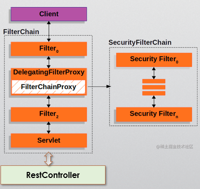

通过filter proxy的方式注入拦截器

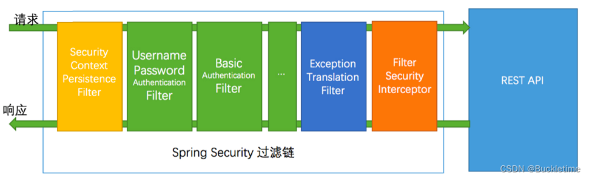

- 安全上下文保持过滤器`SecurityContextPersistenceFilter`：加载与该请求相关的安全上下文信息（如加载用户名、密码）
- 用户名密码验证过滤器`UsernamePasswordAuthenticationFilter`：处理来自请求的用户名和密码
- 基本身份验证过滤器`BasicAuthenticationFilter`：处理http基本身份验证
- 异常翻译过滤器`ExceptionTranslationFilter`：处理Accessdenied异常和Authentication异常。给前端返回过去
- FilterSecurityInterceptor：过滤链的出口

## 2  Basic Authentication

引入依赖：

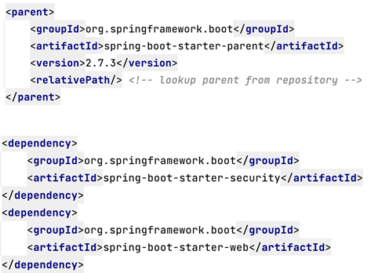

如果只引入类库：有了一个基础的认证的框架。

可在`application.yaml`中配置用户名和密码：

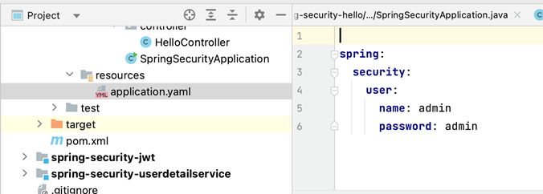

## 3 UserDetailService

spring-security-userdetailservice项目：

* `passwordEncoder`：通过这个bean进行加密。数据库中的密码要密文存储
* `UserDetails`对象是spring security要求的

运行sql脚本

运行项目，访问`localhost:8080`，地址自动跳到`localhost:8080/login`，同时出现初始页面：

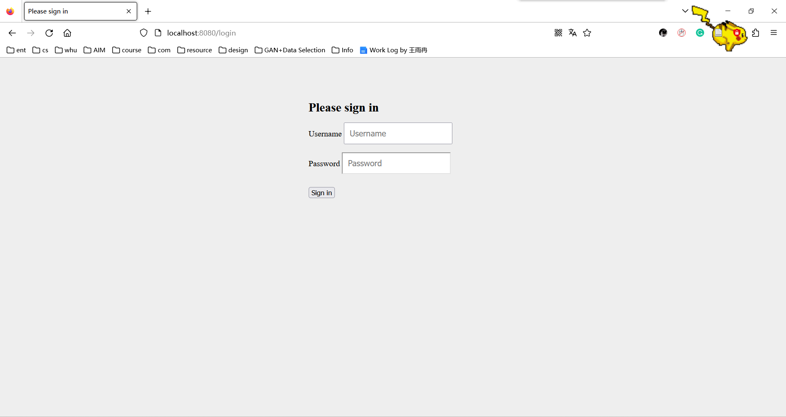

输入数据库存在的用户，username=user1，password=abc：

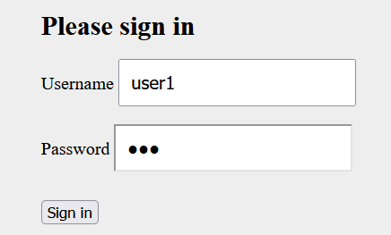

登录后，访问`localhost:8080/hello`：

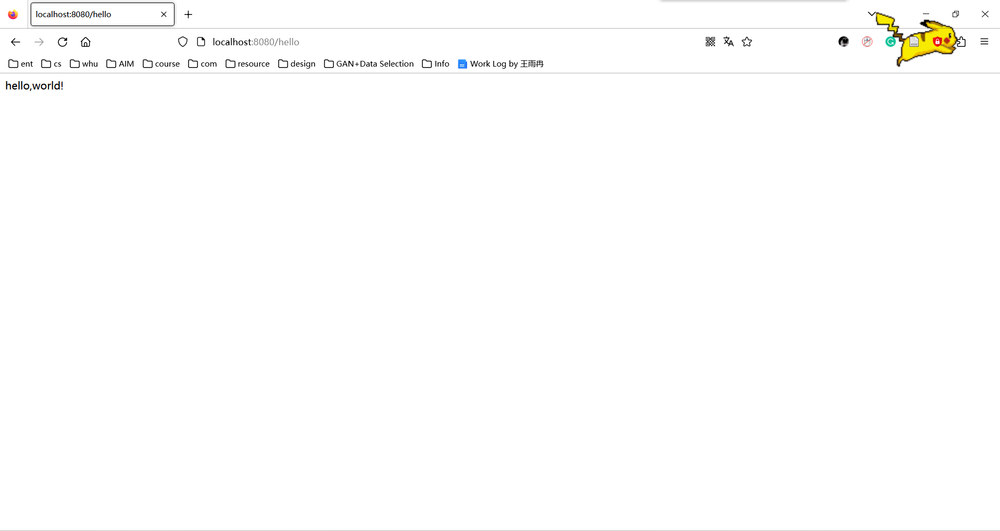

同一个密码，加密后的密文不一样（有随机性）

如何匹配密码：参见`UserServiceTest`类中的`addUser()`方法，`assertTrue(passwordEncoder.matches("abc",userdto.getPassword()));`

## 4 JWT Authentication

### Session-based authentication

session机制的缺陷：

* 有些客户端（如移动应用）没有cookie来保存sessionid
* 难以用于分布式应用
  * 单点登录：产生session同步问题。不同的服务器没有同样的cookie，认为用户没有登录
  * 负载均衡

### Token-based authentication

哈希字符串称为token，拿到token后，所有请求都会带上它访问服务器，验证token是否合法

只要密钥在所有服务器中共享，则可以用token访问所有服务器

### **JWT (** JSON Web Token )

JWT是一个开放的标准，用于共享各方之间的安全信息。
每个JWT都包含经过编码的JSON对象，包括一组claims。
JWTs使用密码算法进行签名，以确保在令牌发出后债权不能被更改。

如何生成JWT token信息：

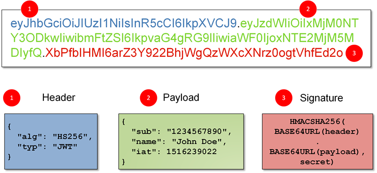

第3部分：签名用于验证前面的信息是否正确，是否经过手工篡改，避免伪造

参见spring-security-jwt项目：`JWTTest`类

###  JWT authentication with Spring Security

JWT组成部分：主要是三个类

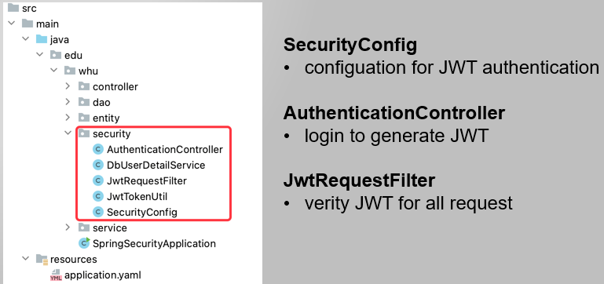

* `JwtRequestFilter`

  * 作用：过滤器，解析token得出用户信息，验证用户信息是否合法

  * 步骤

    * `Claims`类需要引入依赖：

      ```xml
      <dependency>
                  <groupId>io.jsonwebtoken</groupId>
                  <artifactId>jjwt</artifactId>
                  <version>0.9.1</version>
              </dependency>
      ```

* 配置SecurityConfig

  * 作用：
    * 把过滤器加入Spring Security Filters Chains：添加`jwtRequestFilter`过滤器到`UsernamePasswordAuthenticationFilter`之前，拦截用户请求
    * 配置授权
    * 密码加密

* `AuthenticationController`
  * 实现登录验证逻辑

其他：

* `DbUserDetailService`
  * 作用：根据用户名 从数据库中**加载用户信息**
  
  * 步骤：
  
    * 添加`@Service`
  
    * 自动注入`UserService`对象
  
    * 继承`UserDetailsService`接口
  
      * 需要依赖：
  
        > ```xml
        > <dependency>
        >             <groupId>org.springframework.boot</groupId>
        >             <artifactId>spring-boot-starter-security</artifactId>
        >         </dependency>
        > ```
  
      * 实现接口方法`loadUserByUsername`
* `JwtTokenUtil`
  * 解析和验证JWT令牌的工具类

## 5 Cache

在`UserService`类的`getUser`方法上加`@Cacheable`

在`SpringSecurityJWTApplication`启动类上加上`@EnableCaching`

> Redis缓存技术

## 6 Authorization

### Role-based Access Control (RBAC) 基于角色的授权

每个角色有自己的权限

角色就是权限

#### Role-based Dynamic Authorization

建一个角色表，角色可以对应多个权限，给角色分配权限

### Expression-Based Access Control

通过加`@PreAuthorize`，实现鉴权操作

如：

```java
@PostMapping
@PreAuthorize("hasAuthority('user/update')")
public void addUser(@RequestBody User user){
    userService.save(user);
}
```

指定了只有具有"user/update"权限的用户才能调用这个方法。如果用户没有该权限，将会被拒绝访问。这是一种基于角色或权限的访问控制。

## Assignment7

### 完成过程

* JWT

  * 创建`User`, `Role`, `UserDto`实体类

  * 添加`UserDao`, `RoleDao`接口

  * 实现`UserService`类
  * 创建security包下的五个类

* 缓存优化

  * 给`UserService`类的方法加上注解
  * 给启动类加上`@EnableCaching`

* 实现基于角色的权限

  * 要求：
    * 商品、供应商允许所有登录用户进行<u>查询</u>
    * 只允许具有商品管理、供应商管理权限的用户进行<u>修改</u>
  * 步骤：
    * 在`DbUserDetailService`类的`loadUserByUsername()`方法中给用户加载查询到的权限
    * 在`SecurityConfig`类的`securityFilterChain()`方法中**配置授权**
  * sql脚本配置数据表

### 错误解决

1. 外键约束命名重复

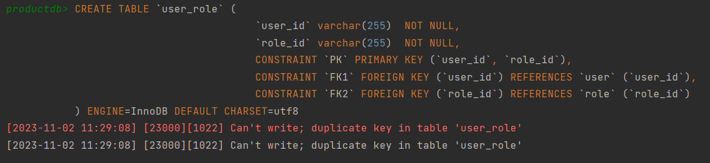

解决：修改约束命名

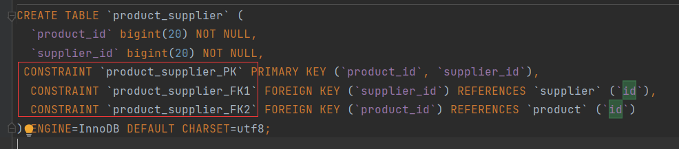

2. 

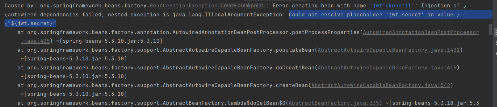

解决：`application.yaml`文件中添加：

```yaml
#可以用命令行生成64位密钥： openssl rand -hex 64
jwt:
  secret: db9d654c4860d4d37406d1ffcd92be5756a9ea94c03464aba0e475dc88932fee2278a23f6e6953a24d089ad09d99ac9d07ebd223a7f264fa2a7bea8a779c7946
```

3. sql又双叒叕连不上

解决：依赖版本问题
